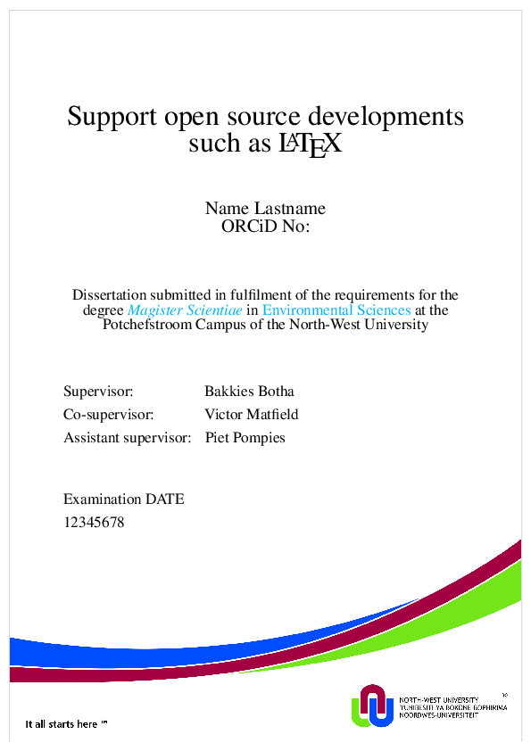

# The-unoffical-NWU-LaTeX-template

This is a unofficial LaTeX template for the NWU, I do not own it or take any responsibility for it.

I assume you know more or less what you're doing if you're on github and using latex.The preamble lives in the /main/nwu_unofficial_latex.tex directory. To compile without any options do: 

```zsh
$ cd main 
$ lualatex nwu_unofficial_latex.tex 
```

If you have figured things more or less out, have a glossary and bibliography with citations I usually do this compile twice with zsh using -  

```zsh
$ repeat 2 { makeglossaries nwu_unofficial_latex && bibtex nwu_unofficial_latex && lualatex nwu_unofficial_latex.tex }
```

I think the most important thing is to inspect the tex file in the main directory, things will make more sense then. Remember to remove the \lipsum call to get rid of the random lipsum text.

*I use vim, but I can recommend TexMaker for windows platforms. I recommend using lualatex compile option here to*



**NOTE: The NWU recently changed its primary colors, make sure you aware of this when using this template.**
