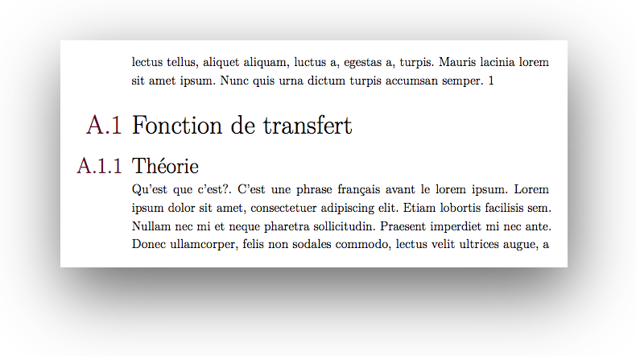
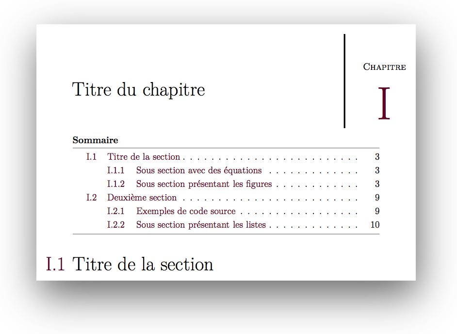
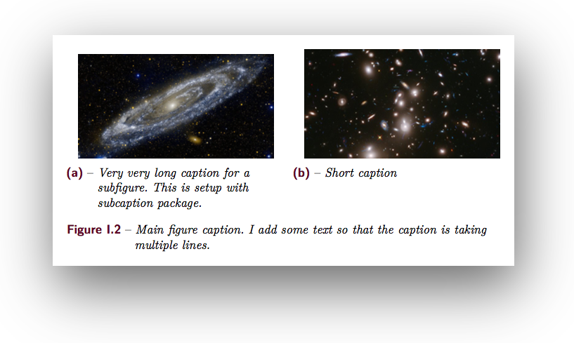
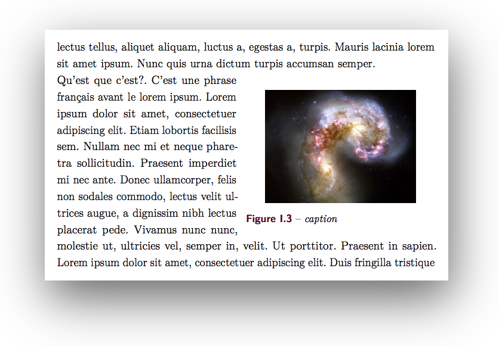
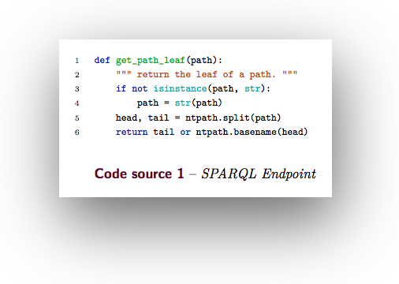

# Clean LaTeX Template

It's the template I made for my master Thesis. It can be easily customizable.

<!-- vim-markdown-toc GFM -->

* [Installation](#installation)
* [Architecture of the project](#architecture-of-the-project)
* [Using the Makefile](#using-the-makefile)
    * [Entire project](#entire-project)
    * [Subfiles](#subfiles)
    * [Tikz Figures](#tikz-figures)
    * [Create a subfile](#create-a-subfile)
    * [Create a Tikz File](#create-a-tikz-file)
* [Customization](#customization)
* [Snippets and workflows](#snippets-and-workflows)
    * [Chapter with a shorter name for the footer and the table of contents](#chapter-with-a-shorter-name-for-the-footer-and-the-table-of-contents)
    * [Unnumbered chapter](#unnumbered-chapter)
    * [Small table of contents for a chapter](#small-table-of-contents-for-a-chapter)
    * [Simple figure](#simple-figure)
    * [Subfigures](#subfigures)
    * [Wrap Figure](#wrap-figure)
    * [Insert Code](#insert-code)
    * [Tikz](#tikz)
* [Ressources](#ressources)
* [TODO](#todo)

<!-- vim-markdown-toc -->


## Installation

In order to use this template, you must have an up to date distribution of LaTeX ([MaxTeX](http://www.tug.org/mactex/) for MacOS and [TeXLive](http://www.tug.org/texlive/) for Linux and Windows). You can also use some online like [Overleaf](https://www.overleaf.com/) or [ShareLatex](https://www.sharelatex.com/).

If you're on Linux or MacOs, you should install `latexmk` with automate the process of generating LaTeX documents. `latexmk` is used by the makefile to make the pdf output ([latexmk](https://www.ctan.org/pkg/latexmk/)).

You also need `pygments` if you want to include some source code ([pygments](http://pygments.org/)).

## Architecture of the project

First of all, you will find the `main.tex` file. This is the main file of the project.

```
.
└── main/main.tex
```

Then, there is a bunch of subfiles that can be compiled independently. You can create as many subfiles as you want (preferably using the makefile).

```
.
├── titlepage/titlepage.tex
├── introduction/introduction.tex
├── chap1/chap1.tex
├── chap2/chap2.tex
├── conclusion/conclusion.tex
├── appendixA/appendixA.tex
└── appendixB/appendixB.tex
```

Other files and folders

```
.
├── Makefile => used to build the project
├── configuration => directory with all the configuration
├── frontmatter => containing everything composing the frontmatter (abstract, list of figures, ...)
├── references => containing your .bib files
├── ressources => you should put all your figures/images/included stuff here
└── snippets => you can find here some usefull snippets (used by the makefile to generate things)
```


## Using the Makefile

The Makefile is used to

### Entire project

| command      | commentary                                                                     |
| ------------ | ------------------------------------------------------------------------------ |
| `make`       | Build the entire project                                                       |
| `make pdf`   | Build the entire project                                                       |
| `make watch` | Watch for changes and rebuild the entire project                               |
| `make open`  | Open the generated pdf                                                         |
| `make clean` | Clean the `main/build` directory                                               |


### Subfiles

| command      | filename     | commentary                                                                     |
| ------------ | ------------ | ------------------------------------------------------------------------------ |
| `make pdf`   | `f=filename` | Build the subfile located `filename/filename.tex` into `filename/filename.pdf` |
| `make watch` | `f=filename` | Watch the file for changes                                                     |
| `make open`  | `f=filename` | Open the pdf file corresponding to the filename                                |


### Tikz Figures

| command      | filename     | type     | commentary                                                                     |
| ------------ | ------------ | -------- | ------------------------------------------------------------------------------ |
| `make pdf`   | `f=filename` | `t=tikz` | Build `ressources/tikz/filename.tex` into `ressources/tikz/filename.pdf`       |
| `make pdf`   |              | `t=tikz` | Build all `.tex` files into the `ressources/tikz/` folder into `.pdf` files    |
| `make watch` | `f=filename` | `t=tikz` | Continuously compile a tikz file into a pdf                                    |
| `make open`  | `f=filename` | `t=tikz` | Open the pdf file corresponding to the Tikz figure                             |


### Create a subfile

You can create as many subfiles as you want

| command        | filename     | commentary                                                                                  |
| ------------   | ------------ | ------------------------------------------------------------------------------              |
| `make subfile` | `f=filename` | Create a folder and a file `filename/filename.tex` with everything needed to make a subfile |


### Create a Tikz File

| command      | filename     | commentary                                                                               |
| ------------ | ------------ | ------------------------------------------------------------------------------           |
| `make tikz`  | `f=filename` | Create a standalone `.tex` containing a tikz picture here `ressources/tikz/filename.tex` |


## Customization

Everything is customizable.
Most of the customization can be done in `configuration/variables.tex`:
- Title page logos and names
- Colors
- Name of list of source code, list of tables, table of contents, nomenclature, ...
- Whether you want section numbering into margin (see image below)




## Snippets and workflows


### Chapter with a shorter name for the footer and the table of contents

``` tex
\chapter[Nom du chapitre dans le sommaire]{Nom du chapitre}%
\chaptermark{Nom du chapitre pour le footer}%
\label{chap:label-du-chapitre}
```

### Unnumbered chapter

``` tex
\chapter*{Nom du chapitre}%
\label{chap:label-du-chapitre}
\addcontentsline{toc}{chapter}{\protect\numberline{}Nom du chapitre}
\unumeredchaptermark{Nom du chapitre}
```

### Small table of contents for a chapter

``` tex
\chapter{Nom du chapitre}
\chaptertoc{}
```



### Simple figure

``` tex
\begin{figure}[htbp]
    \centering
    \includegraphics[width=0.8\textwidth]{image1.jpg}
    \caption{caption}%
    \label{fig:label}
\end{figure}
```

### Subfigures

``` tex
\begin{figure}[htbp]
    \centering
    \begin{subfigure}[t]{0.49\textwidth}
        \centering
        \includegraphics[width=0.9\textwidth]{image2.jpg}
        \caption{Very very long caption for a subfigure. This is setup with subcaption package.}%
        \label{fig:1a}
    \end{subfigure}
    \hfill
    \begin{subfigure}[t]{0.49\textwidth}
        \centering
        \includegraphics[width=0.9\textwidth]{image3.jpg}
        \caption{Short caption}%
        \label{fig:1b}
    \end{subfigure}
    \caption{Main figure caption. I add some text so that the caption is taking multiple lines.}%
    \label{fig:1}
\end{figure}
```




### Wrap Figure

``` tex
\begin{wrapfigure}{r}{0.5\textwidth} % l for left, r for right
    \centering
    \includegraphics[width=0.4\textwidth]{image4.jpg}%
    \caption{caption}%
    \label{fig:wrapfig}
\end{wrapfigure}
```




### Insert Code

``` tex
\begin{listing}[H]
\begin{pythoncode}
def get_path_leaf(path):
    """ return the leaf of a path. """
    if not isinstance(path, str):
        path = str(path)
    head, tail = ntpath.split(path)
    return tail or ntpath.basename(head)
\end{pythoncode}
\caption{SPARQL Endpoint}%
\label{lst:SPARQL Endpoint}
\end{listing}
```



You can also insert directly a source code file (your file must be inside the `ressources/code/` folder)

``` tex
\begin{listing}[H]
\pythonfile{\codefolder{hello-world.py}}
\caption{This piece of code is an included file}%
\label{lst:included-code}%
\end{listing}
```


### Tikz

You should create one .tex file for each Tikz picture with the standalone class as below.

``` tex
\documentclass[12pt,tikz]{standalone}

\ifstandalone%
    \usepackage{import}
    \import{../../configuration/}{comon_packages.tex}%
    \import{../../configuration/}{variables.tex}%
    \import{../../configuration/}{conftikz.tex}%
    \import{../../configuration/}{custom_config.tex}%
\fi

\begin{document}
    \begin{tikzpicture}
        \draw[->, >=latex] (0, 0) -- (0, 1);
    \end{tikzpicture}
\end{document}
```

This file should be located in the `ressources/tikz/` directory. This permit to compile this file on its own. Alternatively, you can use `make tikz f=filename` to create a this tikz file.

To include it into your document, you could use `\includestandalone` like below.

``` tex
\begin{figure}[ht]
    \centering
    \includestandalone{filename}
    \caption{Caption}%
    \label{fig:label}
\end{figure}
```

But it will compile each time you make your main file and it will not work for subfiles for some reasons.

You should instead generate a pdf from this tikz file (using `make pdf f=filename t=tikz`). It will create the file `filename.pdf` in the same directory (`ressources/tikz`).

You can then include it using `\includegraphics`.

``` tex
\begin{figure}[ht]
    \centering
    \includegraphics{filename}
    \caption{Caption}%
    \label{fig:label}
\end{figure}
```

It will produce the exact same output but with no compilation time.


## Ressources

- http://ash.id.au/post/2014/09/19/thesis-in-latex/
- https://github.com/derric/cleanthesis
- http://texdoc.net/texmf-dist/doc/support/latexmk/latexmk.pdf
- http://mirrors.ircam.fr/pub/CTAN/macros/latex/contrib/etoc/etoc.pdf


## TODO

- [ ] Utiliser la classe `scrbook` de `KOMA-script`
- [x] Rajouter une variable pour permettre de faire un petit sommaire au début de chaque chapitre
    - [ ] Quand on compile un chapitre tout seul, pas de TOC
    - [ ] Renew la commande chapter pour ajouter automatiquement le chapter toc ?
- [ ] Faire différentes catégories de bibliographie
- [ ] Rajouter le template sur Overleaf et ShareLatex
- [x] Rajouter un espace plus grand après les sous sections
- [ ] Ajout quelques snippets (side figures)

