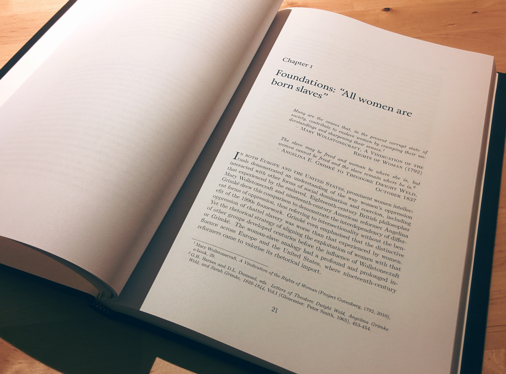

QUThesis
========
A LaTeX package and template for writing a PhD thesis dissertation at the
Queensland University of Technology (QUT)



Introduction
------------
This set of files provides the `quthesis` LaTeX package, which defines a set
of styles and preamble specific to QUT's submission guidelines for writing
PhD dissertations, and a thesis skeleton to help you organise your content
and get writing fast.

The goal of this package is not to provide magical LaTeX hacks (though it does),
but rather to provide a set of sane defaults so you can focus on what's
important - your contribution to the literature - whilst being easy to
understand should you wish to change any of the styles.

I procrastinated writing this boilerplate so you don't have (an excuse) to.

Features
--------

 - The `quthesis` package declaring a set of sane defaults for thesis dissertations
 - A thesis skeleton to help you organise your content and get writing fast
 - Chapters included using the `subfiles` package so they can be compiled independently
 - A `compile` shell script for building the whole document or a single chapter,
   staging intermediate files in a build directory to keep your working directory clean
 - Preconfigured `.gitignore` files to assist in version control
 - Margins and font size optimized for readability
 - Minimal definitions and package includes
 - Clean internal design, so you can understand what's going on
 - Makes a best effort to conform to QUT's [style requirements](https://cms.qut.edu.au/__data/assets/pdf_file/0004/7249/requirements-for-presenting-theses.pdf)

Getting started
---------------

 1. Clone the repository
  
    ```
    git clone https://github.com/hbristow/quthesis
    ```

 2. Build the existing sources

    ```
    cd quthesis
    ./compile
    ```

 3. Modify `thesis.tex` with your details
 4. Check out each of the `*-*.tex` files to see how chapters using `subfiles` operate
 5. Check out `manual.pdf` and `manual.tex` for details on the features quthesis provides
